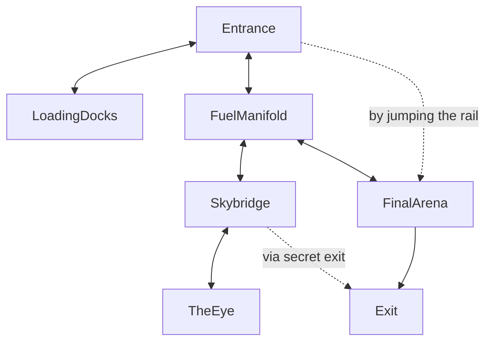

```ad-warning

Draft

```


In _World of Warcraft_, and similar MMORPGs, the game is structured as a loop-and-pitlane. You start in the pits at level 1. You accelerate out and onto the main track and slowly come up to speed over the course of many long laps attempting to defeat different bosses in endgame content. We often call this a 'Loot Treadmill' -- where progress is gated by repeated attempts at hard content. Partial success is rewarded with upgrades, which aid future progress. 

Progression Raiding in _WoW_ is the 'real' game, it's where the majority of the balancing effort goes, it's where the narrative progresses, it's also buried under a long, usually pretty boring progression through the 'pitlane' of leveling up.

I really like raids; they're delightful puzzles of Dexterity, Memory, and Strategy. Finding out the mechanics, developing ways to counter them, learning the steps, improvising when things don't work. Near misses, clutch wins, Hunters kiting bosses for the last few slivers of their HP. It's great, everyone should try it. It's all the other stuff in WoW that kinda sucks. At the endgame of WoW, it's Daily Quests, maintaining crafting cooldowns, and running around Dalaran. It's not WoW's fault, they couldn't (and really still can't) offer the kind of deep narrative progression outside of the raids because they don't have the resources for it. At the scale of a TTRPG, though, it's much easier.

Separately, a thing that has burnt me out more than once in a Campaign is the construction of a set-piece dungeon that is rapidly and unceremoniously destroyed by a clever player group. It's not that I am upset by the cleverness, on the contrary, but there is something quite demoralizing about building a cool dungeon with custom mechanics only to have it utterly smashed by a group of PCs with a bag of marbles and a 3m pole. Worse is when you spend a lot of energy balancing an encounter, only to find you got it wrong and you need to nerf it mid combat to avoid an _utterly_ unfair TPK. I don't like pulling punches, but I hate bullshit deaths more, so I'm left turning a cool encounter into a slapfight. It just sucks.

_Infinite Dungeon_ is what I wish WoW was, meaningful progression all the time; while maintaining the challenge and set-piece-coolness of Raids. It's also what I wish those set-piece dungeons were allowed to be -- I'm sure I could've re-run those encounters, maybe re-skinned, but I didn't _want_ to reskin them. I want to be able to iterate on the design of an encounter, hone it until I'm happy with it, spend time improving it's assets, and then _leave it there so you can do it again_. Running raids is fun _despite_ the fact it's repetitive; indeed, they're fun _because_ of the repetition.

D&D-adjacent TTRPG, on the whole, emphasizes dice as the primary way to interact during combat; in D&D especially, fights de-emphasize movement as a rule, and often devolve into slap fights where we roll die at each other. In _Infinite Dungeon_, the goal is to add tools to emphasize movement and the use of the environment tactically.

This section will cover how RAIDs work by going through the design of a raid from end to end.

# The Infernal Machine


The Infernal Machine is the first raid I designed. It started out as an adventure plan where players would _only_ do the raiding part, but rapidly it became obvious that they'd need somewhere to prepare, and thus the rest of _Infinite Dungeon_ followed. This is structured roughly as a five-room dungeon, but the entrance is unguarded. The topology of the RAID is:



Players can, in principle, 'rush' the encounter by jumping right to the final boss, but they will find the boss much harder, since each section of the raid has a way of de-powering the boss.

- The Loading Docks encounter supplies the [Vesper](04.%20Loot.md#Vesper) used for the bosses lair actions and legendary actions later.
- The Fuel Manifold contains a sub boss who will appear to assist the final boss if not defeated.
- The Skybridge Depth Crawl leads to The Eye, where the players can learn about the final boss' weaknesses and also disable one of it's special abilities.

Once the raid is entered, it can only be exited by a valid exit. The depthcrawl can offer an occasional secret exit, allowing a potential quick run where you can avoid the final boss to escape with the loot from the others.

Additionally, each wing offers a different source of loot. The Loading Docks side has a _ton_ of Vesper, the main problem for the players would be figuring out how to move so much explosive, heavy material. The Fuel Manifold section is mostly a DPS check, but gates access to the Skybridge, where lots of [Ducats](04.%20Loot.md#Ducats) are on offer, as well as lore, items, etc. It's a relatively short depth-crawl while ascending a spiraling sort of administrative structure. The Final Arena contains the titular Infernal Machine, which offers fame items for it's defeat.


---

Repeatable, Action-oriented, Iterated Dungeons

Intended to be repeated multiple times, intentionally overtuned.

Multiple 'modes', an Intro so I can show you roughly whats available, scripted death will be telegraphed for this mode if there is one, good way to cash in a character.

Normal/Heroic/Mythic for bigger fame rewards/better loot


May have entry requirements, including:

1. System the characters entering are using
2. Level reqs within that system
3. Minimum Fame reqs
4. Arbitrary other narrative requirements

These are intended to be a way to test characters and give you an easy way to cash in a character you think is likely to die and is also saddled with a lot of fame you want to use.